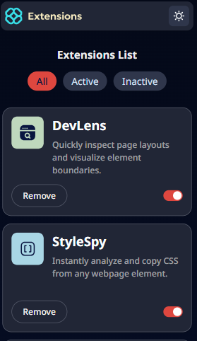
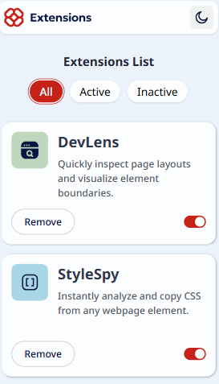

# 📦 Browser Extensions Manager

A responsive **browser extensions manager UI** built with **React** and **Tailwind CSS**.  
The app allows users to view, activate/deactivate, and remove extensions in a smooth and interactive interface that supports dark mode.

---

## Screenshots 📷
 

### Click [here](https://browser-extensions-managerr.netlify.app/) to watch online demo

---
## Features 📝

 

### - Dark Mode Support

The entire interface adapts to light and dark modes for a comfortable viewing experience.

### - Tabs for Filtering Extensions

Switch between:

- **All** extensions
- **Active** extensions
- **Inactive** extensions

Each tab displays only the related extensions.

### - Toggle Activation

Every extension includes a toggle switch allowing you to:

- Activate inactive extensions
- Deactivate active extensions

State updates instantly and the extension moves to the correct tab automatically.

### - Delete Extensions

Each extension has a delete button with a smooth scale-out animation before removal.

### - Fully Responsive

Designed to work perfectly across:

- Mobile
- Tablet
- Desktop

### - Built with Modern Tools

- **React** for UI logic
- **Tailwind CSS** for fast styling
- Clean state management for filters, toggles, and deletion

---

## Tech Stack

| Technology       | Description                    |
| ---------------- | ------------------------------ |
| **React**        | Component-based UI library     |
| **Tailwind CSS** | Utility-first CSS framework    |
| **LocalStorage** | Used to persist the active tab |

---

## Installation ⚙️

```bash
1. git clone https://github.com/01mehran/browser-extensions-manager.git

2. cd browser-extensions-manager

3. pnpm install

4. pnpm run dev

```

## Contributions 🙌

Contributions are welcome! Feel free to open issues or submit pull requests.

## contact me 
[LinkedIn](https://www.linkedin.com/in/mehrandev7) 💼
[Email me](mailto:mehranmohamadi1311@gmail.com) 📧

